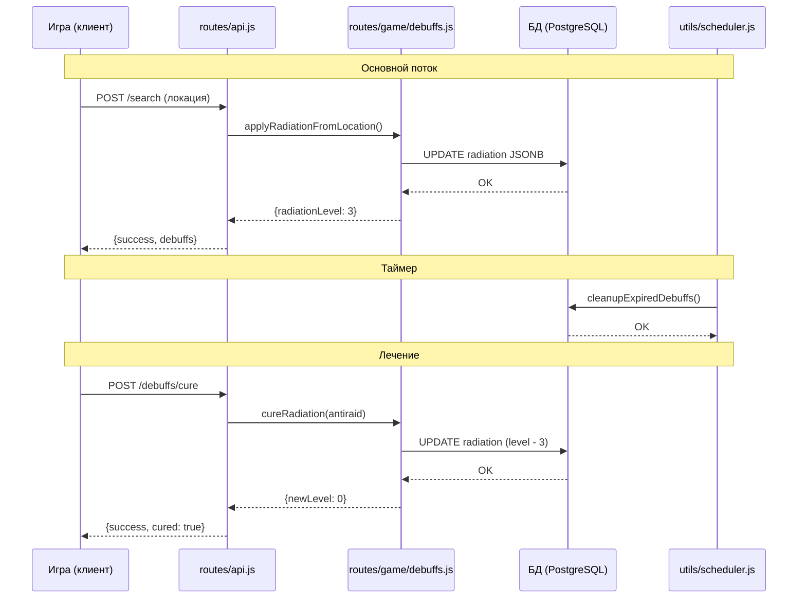

# Система дебаффов для Last Hearth

## 1. Обзор архитектуры

Дебаффы в игре — это временные негативные состояния персонажа, которые влияют на его характеристики и способности. Они могут применяться от различных источников (радиоактивные зоны, зомби) и истекают по таймеру или лечатся предметами.

```mermaid
flowchart TD
    A[Источники дебаффов] --> B[Локации<br/>радиоактивные зоны]
    A --> C[Зомби<br/>атаки]
    A --> D[Сундуки<br/>события]
    
    B --> E[Применение radiation]
    C --> F[Применение infection]
    
    E --> G[JSONB: radiation<br/>{level, expires_at}]
    F --> H[JSONB: infections<br/>[{type, level, expires_at}]]
    
    G --> I{Таймер истёк?}
    H --> I
    
    I -->|Да| J[Дебафф истёк]
    I -->|Нет| K[Активный дебафф]
    
    K --> L[Влияние на stats]
    L --> M[Слабее бьёшь]
    L --> N[Хуже ищешь]
    L --> O[Дольше действия]
    L --> P[Меньше удача]
    
    J --> Q[Удаление дебаффа]
    
    K --> R[Лечение предметами]
    R --> S[Антирадин / Аптечка]
    R --> T[Антибиотики / Уколы]
    
    S --> G
    T --> H
```

---

## 2. Структура БД

### 2.1 Изменения в таблице players

**Удалить поля:**
- `hunger` (голод)
- `thirst` (жажда)  
- `broken_bones` (переломы)
- `broken_leg` (перелом ноги)
- `broken_arm` (перелом руки)

**Изменить поле radiation:**
```sql
-- БЫЛО (INTEGER):
radiation INTEGER DEFAULT 0

-- СТАЛО (JSONB):
radiation JSONB DEFAULT '{"level": 0, "expires_at": null}'
-- Структура: { level: number, expires_at: timestamp | null }
```

**Изменить поле infections:**
```sql
-- БЫЛО (JSONB массив):
infections JSONB DEFAULT '[]'

-- СТАНОВИТСЯ (JSONB массив объектов):
infections JSONB DEFAULT '[]'
-- Структура: [{ type: 'zombie_infection', level: 1, expires_at: '2026-03-10T12:00:00Z' }]
```

### 2.2 Расширенная схема дебаффов

```javascript
// Дебафф radiation
{
    "type": "radiation",
    "level": 3,           // 1-10 уровней
    "expires_at": "2026-03-10T18:30:00Z",  // время истечения
    "applied_at": "2026-03-10T12:30:00Z"  // когда применён
}

// Дебафф infection
{
    "type": "zombie_infection",  // тип инфекции
    "level": 2,                   // 1-10 уровней
    "expires_at": "2026-03-11T08:00:00Z",
    "applied_at": "2026-03-10T14:00:00Z",
    "source": "zombie_id_123"    // источник (опционально)
}
```

---

## 3. Константы дебаффов (gameConstants.js)

```javascript
// Типы дебаффов
const DEBUFF_TYPES = {
    RADIATION: 'radiation',
    INFECTION: 'zombie_infection'
};

// Конфигурация дебаффов
const DEBUFF_CONFIG = {
    // Радиация
    radiation: {
        baseDuration: 6 * 60 * 60 * 1000,  // 6 часов в мс
        durationPerLevel: 2 * 60 * 60 * 1000,  // +2 часа за уровень
        maxLevel: 10,
        minLevel: 1,
        damagePerLevel: 2,  // урон здоровью в час при level >= 5
        regenRate: 30 * 60 * 1000  // естественное снижение каждые 30 мин
    },
    
    // Инфекция
    infection: {
        baseDuration: 12 * 60 * 60 * 1000,  // 12 часов
        durationPerLevel: 4 * 60 * 60 * 1000,  // +4 часа за уровень
        maxLevel: 10,
        minLevel: 1,
        damagePerLevel: 3,  // урон здоровью в час
        regenRate: 60 * 60 * 1000  // естественное снижение каждый час
    }
};

// Множители влияния на статы (за каждый уровень дебаффа)
const DEBUFF_EFFECTS = {
    // Радиация: сильно бьёт по удаче и поиску
    radiation: {
        strength: -0.03,      // -3% к урону за уровень
        luck: -0.05,          // -5% к удаче за уровень
        searchTime: 0.10,    // +10% ко времени поиска за уровень
        dropChance: -0.03    // -3% к шансу дропа за уровень
    },
    
    // Инфекция: сильно бьёт по силе и выносливости
    infection: {
        strength: -0.05,      // -5% к урону за уровень
        endurance: -0.03,    // -3% к выносливости за уровень
        searchTime: 0.05,    // +5% ко времени поиска за уровень
        dropChance: -0.02    // -2% к шансу дропа за уровень
    }
};

// Предметы для лечения дебаффов
const DEBUFF_CURES = {
    // Радиация
    antiraid: {
        radiationReduction: 3,  // -3 уровня
        itemId: 'antiraid',
        name: 'Антирадин'
    },
    medkit: {
        radiationReduction: 2,  // -2 уровня
        itemId: 'medkit',
        name: 'Аптечка'
    },
    
    // Инфекция
    antibiotic: {
        infectionReduction: 2,  // -2 уровня
        itemId: 'antibiotic',
        name: 'Антибиотики'
    },
    injection: {
        infectionReduction: 3,  // -3 уровня
        itemId: 'injection',
        name: 'Укол'
    }
};
```

---

## 4. API дебаффов (серверная часть)

### 4.1 Структура файла: routes/game/debuffs.js

```javascript
// Namespace: DebuffAPI

const DebuffAPI = {
    /**
     * Применить дебафф к игроку
     * @param {number} playerId - ID игрока
     * @param {string} type - тип дебаффа (radiation, infection)
     * @param {number} level - уровень дебаффа
     * @param {object} options - дополнительные опции
     * @returns {Promise<object>} результат
     */
    async apply(playerId, type, level, options = {}) { },
    
    /**
     * Проверить и обновить дебаффы игрока
     * @param {number} playerId - ID игрока
     * @returns {Promise<object>} статус дебаффов
     */
    async check(playerId) { },
    
    /**
     * Получить активные дебаффы игрока
     * @param {object} player - объект игрока
     * @returns {object} активные дебаффы
     */
    getActive(player) { },
    
    /**
     * Лечить дебафф предметом
     * @param {number} playerId - ID игрока
     * @param {string} cureType - тип лечения
     * @param {number} itemId - ID предмета
     * @returns {Promise<object>} результат
     */
    async cure(playerId, cureType, itemId) { },
    
    /**
     * Рассчитать множители дебаффов для stats
     * @param {object} player - объект игрока
     * @returns {object} множители
     */
    calculateModifiers(player) { }
};
```

### 4.2 Эндпоинты API

```
GET  /api/game/debuffs/status    - Получить статус дебаффов
POST /api/game/debuffs/check    - Проверить дебаффы (принудительно)
POST /api/game/debuffs/cure     - Лечить дебафф предметом
POST /api/game/debuffs/apply    - Применить дебафф (для зомби/событий)
```

---

## 5. Логика применения дебаффов

### 5.1 От радиоактивных локаций

```javascript
/**
 * Применение радиации при поиске на локации
 * @param {object} player - игрок
 * @param {object} location - локация
 * @returns {Promise<object>} результат
 */
async function applyRadiationFromLocation(player, location) {
    // Базовая радиация от локации (из БД локаций)
    const locationRadiation = location.radiation || 0;
    
    // Защита от радиации (из экипировки)
    const radiationDefense = calculateRadiationDefense(player.equipment);
    
    // Итоговая радиация: (локация - защита) / 10 + случайность
    let radiationGain = Math.max(0, locationRadiation - radiationDefense);
    radiationGain = Math.ceil(radiationGain / 10);
    
    // Добавляем случайность (±20%)
    const randomFactor = 0.8 + Math.random() * 0.4;
    radiationGain = Math.ceil(radiationGain * randomFactor);
    
    // Применяем дебафф
    if (radiationGain > 0) {
        await DebuffAPI.apply(player.id, 'radiation', radiationGain, {
            source: `location_${location.id}`
        });
    }
    
    return { radiationGain, defense: radiationDefense };
}

/**
 * Расчёт защиты от радиации
 */
function calculateRadiationDefense(equipment) {
    let defense = 0;
    
    // Броня
    if (equipment.body?.stats?.radiationDefense) {
        defense += equipment.body.stats.radiationDefense;
    }
    if (equipment.head?.stats?.radiationDefense) {
        defense += equipment.head.stats.radiationDefense;
    }
    
    // Другие предметы с защитой
    if (equipment.helmet?.stats?.radiationDefense) {
        defense += equipment.helmet.stats.radiationDefense;
    }
    
    return defense;
}
```

### 5.2 От зомби

```javascript
/**
 * Применение инфекции при атаке зомби
 */
async function applyInfectionFromZombie(player, zombieLevel) {
    // Шанс инфекции зависит от уровня зомби
    const infectionChance = Math.min(0.5, zombieLevel * 0.05);  // 5% за уровень, макс 50%
    
    if (Math.random() < infectionChance) {
        const level = Math.ceil(zombieLevel / 3);  // 1-3 уровень инфекции
        await DebuffAPI.apply(player.id, 'zombie_infection', level, {
            source: `zombie_level_${zombieLevel}`
        });
    }
}
```

---

## 6. Проверка дебаффов по таймеру

### 6.1 При каждом действии (on-the-fly)

```javascript
/**
 * Проверка дебаффов при действиях игрока
 * Вызывается в начале каждого значимого действия
 */
async function checkDebuffsOnAction(playerId) {
    const result = await DebuffAPI.check(playerId);
    
    if (result.expired.length > 0) {
        // Дебаффы истекли - уведомляем игрока
        return {
            expired: result.expired,
            message: `Дебаффы истекли: ${result.expired.join(', ')}`
        };
    }
    
    return { active: result.active };
}
```

### 6.2 Фоновый scheduler

```javascript
// utils/scheduler.js

/**
 * Очистка истёкших дебаффов
 * Запускается каждые 5 минут
 */
async function cleanupExpiredDebuffs() {
    await tx(async () => {
        // Очистка radiation
        await query(`
            UPDATE players 
            SET radiation = jsonb_set(
                radiation, 
                '{level}', 
                '0'
            )::jsonb
            WHERE radiation->>'expires_at' IS NOT NULL 
            AND radiation->>'expires_at' < NOW()::text
        `);
        
        // Очистка инфекций
        await query(`
            UPDATE players 
            SET infections = (
                SELECT jsonb_agg(elem)
                FROM jsonb_array_elements(infections) AS elem
                WHERE elem->>'expires_at' > NOW()::text
            )
            WHERE jsonb_array_length(infections) > 0
        `);
    });
}
```

### 6.3 Проверка при входе в игру

```javascript
// routes/api.js - при /api/game/status

router.get('/status', async (req, res) => {
    const player = req.player;
    
    // Проверяем дебаффы при входе
    const debuffStatus = await DebuffAPI.check(player.id);
    
    res.json({
        success: true,
        player: formatPlayer(player),
        debuffs: {
            active: debuffStatus.active,
            warnings: debuffStatus.warnings  // дебаффы скоро истекут
        }
    });
});
```

---

## 7. Логика лечения дебаффов

### 7.1 Лечение радиации

```javascript
/**
 * Лечение радиации предметом
 */
async function cureRadiation(playerId, item) {
    const cureConfig = DEBUFF_CURES[item.type];
    if (!cureConfig) {
        throw new Error('Неверный тип лечения');
    }
    
    return await tx(async () => {
        const player = await queryOne(
            'SELECT radiation FROM players WHERE id = $1 FOR UPDATE',
            [playerId]
        );
        
        const currentLevel = player.radiation?.level || 0;
        const newLevel = Math.max(0, currentLevel - cureConfig.radiationReduction);
        
        // Пересчитываем время истечения
        const newExpiresAt = calculateNewExpiresAt(newLevel);
        
        await query(`
            UPDATE players 
            SET radiation = $1 
            WHERE id = $2
        `, [{
            level: newLevel,
            expires_at: newExpiresAt,
            applied_at: player.radiation?.applied_at || new Date().toISOString()
        }, playerId]);
        
        return {
            success: true,
            oldLevel: currentLevel,
            newLevel,
            cured: cureConfig.radiationReduction
        };
    });
}
```

### 7.2 Лечение инфекций

```javascript
/**
 * Лечение инфекции предметом
 */
async function cureInfection(playerId, itemId, itemType) {
    const cureConfig = DEBUFF_CURES[itemType];
    
    return await tx(async () => {
        const player = await queryOne(
            'SELECT infections FROM players WHERE id = $1 FOR UPDATE',
            [playerId]
        );
        
        const infections = player.infections || [];
        const remaining = [];
        let totalReduced = 0;
        
        for (const inf of infections) {
            const newLevel = Math.max(0, inf.level - cureConfig.infectionReduction);
            totalReduced += inf.level - newLevel;
            
            if (newLevel > 0) {
                remaining.push({
                    ...inf,
                    level: newLevel,
                    expires_at: calculateNewExpiresAt(newLevel, inf.type)
                });
            }
        }
        
        await query(`
            UPDATE players 
            SET infections = $1 
            WHERE id = $2
        `, [JSON.stringify(remaining), playerId]);
        
        return {
            success: true,
            infectionsRemaining: remaining.length,
            totalReduced
        };
    });
}
```

---

## 8. Влияние дебаффов на stats

### 8.1 Расчёт модификаторов

```javascript
/**
 * Рассчитать все модификаторы от дебаффов
 * @param {object} player - игрок
 * @returns {object} модификаторы (применять как множители)
 */
function calculateDebuffModifiers(player) {
    const radiation = player.radiation || { level: 0 };
    const infections = player.infections || [];
    
    const radLevel = radiation.level || 0;
    const infLevel = infections.reduce((sum, i) => sum + i.level, 0);
    const totalLevel = radLevel + infLevel;
    
    // Базовые множители (1.0 = без изменений)
    const modifiers = {
        damage: 1.0,
        luck: 1.0,
        searchTime: 1.0,
        dropChance: 1.0,
        endurance: 1.0
    };
    
    // Применяем влияние радиации
    if (radLevel > 0) {
        modifiers.damage += radLevel * DEBUFF_EFFECTS.radiation.strength;
        modifiers.luck += radLevel * DEBUFF_EFFECTS.radiation.luck;
        modifiers.searchTime += radLevel * DEBUFF_EFFECTS.radiation.searchTime;
        modifiers.dropChance += radLevel * DEBUFF_EFFECTS.radiation.dropChance;
    }
    
    // Применяем влияние инфекций
    if (infLevel > 0) {
        modifiers.damage += infLevel * DEBUFF_EFFECTS.infection.strength;
        modifiers.endurance += infLevel * DEBUFF_EFFECTS.infection.endurance;
        modifiers.searchTime += infLevel * DEBUFF_EFFECTS.infection.searchTime;
        modifiers.dropChance += infLevel * DEBUFF_EFFECTS.infection.dropChance;
    }
    
    // Ограничиваем минимальные значения
    modifiers.damage = Math.max(0.1, modifiers.damage);
    modifiers.luck = Math.max(0.1, modifiers.luck);
    modifiers.dropChance = Math.max(0.01, modifiers.dropChance);
    modifiers.searchTime = Math.min(3.0, modifiers.searchTime);  // максимум +200% времени
    modifiers.endurance = Math.max(0.1, modifiers.endurance);
    
    return modifiers;
}
```

### 8.2 Применение в игровой логике

```javascript
// При атаке
function calculateAttackDamage(player, target) {
    const baseDamage = player.strength;
    const weaponBonus = player.equipment?.weapon?.stats?.damage || 0;
    
    // Применяем дебаффы
    const modifiers = calculateDebuffModifiers(player);
    const totalDamage = Math.floor((baseDamage + weaponBonus) * modifiers.damage);
    
    return Math.max(1, totalDamage);
}

// При поиске лута
function calculateLootDrop(player, location) {
    const baseChance = calculateDropChance(player.luck);
    
    const modifiers = calculateDebuffModifiers(player);
    const finalChance = baseChance * modifiers.dropChance;
    
    return Math.min(0.6, finalChance);  // макс 60%
}

// Время поиска
function calculateSearchTime(baseTime, player) {
    const modifiers = calculateDebuffModifiers(player);
    return Math.floor(baseTime * modifiers.searchTime);
}
```

---

## 9. Визуализация в интерфейсе

### 9.1 UI элементы

```html
<!-- Панель дебаффов в HUD -->
<div id="debuffs-panel" class="debuffs-panel hidden">
    <!-- Радиация -->
    <div class="debuff-item radiation" id="debuff-radiation">
        <span class="debuff-icon">☢</span>
        <span class="debuff-name">Радиация</span>
        <div class="debuff-bar">
            <div class="debuff-fill" id="radiation-fill"></div>
        </div>
        <span class="debuff-timer" id="radiation-timer"></span>
    </div>
    
    <!-- Инфекции -->
    <div class="debuff-item infection" id="debuff-infection">
        <span class="debuff-icon">🦠</span>
        <span class="debuff-name">Инфекция</span>
        <div class="debuff-bar">
            <div class="debuff-fill" id="infection-fill"></div>
        </div>
        <span class="debuff-timer" id="infection-timer"></span>
    </div>
</div>

<!-- Кнопка лечения (на экране инвентаря/предметов) -->
<button id="cure-debuffs-btn" class="action-btn">
    Лечить дебаффы 💊
</button>
```

### 9.2 Стили (CSS)

```css
.debuffs-panel {
    position: fixed;
    top: 60px;
    right: 10px;
    display: flex;
    flex-direction: column;
    gap: 8px;
    z-index: 100;
}

.debuff-item {
    background: rgba(0, 0, 0, 0.8);
    border: 2px solid #ff4444;
    border-radius: 8px;
    padding: 8px;
    min-width: 150px;
    animation: pulse 2s infinite;
}

.debuff-item.radiation {
    border-color: #00ff00;
    box-shadow: 0 0 10px rgba(0, 255, 0, 0.3);
}

.debuff-item.infection {
    border-color: #ff00ff;
    box-shadow: 0 0 10px rgba(255, 0, 255, 0.3);
}

.debuff-bar {
    height: 6px;
    background: #333;
    border-radius: 3px;
    margin: 4px 0;
    overflow: hidden;
}

.debuff-fill {
    height: 100%;
    background: linear-gradient(90deg, #ff4444, #ff0000);
    transition: width 0.3s;
}

@keyframes pulse {
    0%, 100% { opacity: 1; }
    50% { opacity: 0.7; }
}
```

---

## 10. Клиентская часть (game-state.js)

### 10.1 Расширение gameState

```javascript
const gameState = {
    // ... существующие поля ...
    
    // Активные дебаффы
    debuffs: {
        radiation: {
            level: 0,
            expiresAt: null,
            active: false
        },
        infections: []
    },
    
    // Модификаторы для отображения
    modifiers: {
        damage: 1.0,
        luck: 1.0,
        searchTime: 1.0,
        dropChance: 1.0
    }
};
```

### 10.2 Функции обновления

```javascript
/**
 * Обновить дебаффы из ответа сервера
 */
function updateDebuffs(debuffsData) {
    gameState.debuffs = {
        radiation: {
            level: debuffsData.radiation?.level || 0,
            expiresAt: debuffsData.radiation?.expires_at,
            active: debuffsData.radiation?.level > 0
        },
        infections: debuffsData.infections || []
    };
    
    gameState.modifiers = debuffsData.modifiers || {
        damage: 1.0,
        luck: 1.0,
        searchTime: 1.0,
        dropChance: 1.0
    };
    
    renderDebuffsPanel();
}

/**
 * Отобразить панель дебаффов
 */
function renderDebuffsPanel() {
    const panel = document.getElementById('debuffs-panel');
    
    if (!hasActiveDebuffs()) {
        panel.classList.add('hidden');
        return;
    }
    
    panel.classList.remove('hidden');
    
    // Обновляем радиацию
    const radLevel = gameState.debuffs.radiation.level;
    const radFill = document.getElementById('radiation-fill');
    const radTimer = document.getElementById('radiation-timer');
    
    if (radLevel > 0) {
        radFill.style.width = `${radLevel * 10}%`;
        radTimer.textContent = formatTimeRemaining(gameState.debuffs.radiation.expiresAt);
    }
    
    // Обновляем инфекции
    const totalInfection = gameState.debuffs.infections.reduce((sum, i) => sum + i.level, 0);
    const infFill = document.getElementById('infection-fill');
    const infTimer = document.getElementById('infection-timer');
    
    if (totalInfection > 0) {
        infFill.style.width = `${totalInfection * 10}%`;
        const maxExpires = gameState.debuffs.infections.reduce((max, i) => {
            const exp = new Date(i.expires_at);
            return exp > max ? exp : max;
        }, new Date(0));
        infTimer.textContent = formatTimeRemaining(maxExpires);
    }
}

/**
 * Проверить есть ли активные дебаффы
 */
function hasActiveDebuffs() {
    return gameState.debuffs.radiation.level > 0 || 
           gameState.debuffs.infections.length > 0;
}

/**
 * Форматировать оставшееся время
 */
function formatTimeRemaining(expiresAt) {
    if (!expiresAt) return '';
    
    const now = new Date();
    const expires = new Date(expiresAt);
    const diff = expires - now;
    
    if (diff <= 0) return 'истёк';
    
    const hours = Math.floor(diff / (1000 * 60 * 60));
    const minutes = Math.floor((diff % (1000 * 60 * 60)) / (1000 * 60));
    
    if (hours > 0) {
        return `${hours}ч ${minutes}м`;
    }
    return `${minutes}м`;
}
```

---

## 11. Миграция БД

### 11.1 Миграция: удаление старых полей

```javascript
// db/migrate.js

/**
 * Миграция: удаление hunger/thirst/broken_*
 */
async function migrate_removeOldStatusFields() {
    console.log('🔄 Миграция: удаление старых полей состояния...');
    
    await query(`ALTER TABLE players DROP COLUMN IF EXISTS hunger`);
    await query(`ALTER TABLE players DROP COLUMN IF EXISTS thirst`);
    await query(`ALTER TABLE players DROP COLUMN IF EXISTS broken_bones`);
    await query(`ALTER TABLE players DROP COLUMN IF EXISTS broken_leg`);
    await query(`ALTER TABLE players DROP COLUMN IF EXISTS broken_arm`);
    
    console.log('✅ Удалены поля: hunger, thirst, broken_bones, broken_leg, broken_arm');
}
```

### 11.2 Миграция: изменение radiation

```javascript
/**
 * Миграция: изменить radiation на JSONB
 */
async function migrate_radiationToJsonb() {
    console.log('🔄 Миграция: изменение radiation на JSONB...');
    
    // Проверяем текущий тип
    const result = await query(`
        SELECT data_type 
        FROM information_schema.columns 
        WHERE table_name = 'players' AND column_name = 'radiation'
    `);
    
    if (result.rows[0]?.data_type === 'integer') {
        // Конвертируем INTEGER в JSONB
        await query(`
            UPDATE players 
            SET radiation = jsonb_build_object(
                'level', 
                CASE 
                    WHEN radiation > 10 THEN 10 
                    WHEN radiation < 0 THEN 0 
                    ELSE radiation 
                END,
                'expires_at',
                CASE 
                    WHEN radiation > 0 THEN NOW() + INTERVAL '6 hours'
                    ELSE NULL
                END,
                'applied_at',
                CASE 
                    WHEN radiation > 0 THEN NOW()
                    ELSE NULL
                END
            )
            WHERE radiation > 0 OR radiation IS NOT NULL
        `);
        
        console.log('✅ radiation конвертирован в JSONB');
    }
}
```

---

## 12. Схема взаимодействия модулей



---

## 13. Итоговый план реализации

| # | Задача | Файл | Описание |
|---|--------|------|----------|
| 1 | Миграция БД | db/migrate.js | Удалить hunger/thirst/broken_*, изменить radiation |
| 2 | Константы | utils/gameConstants.js | DEBUFF_TYPES, DEBUFF_CONFIG, DEBUFF_EFFECTS |
| 3 | API дебаффов | routes/game/debuffs.js | apply, check, cure, getActive, calculateModifiers |
| 4 | Интеграция в locations | routes/game/locations.js | Применение radiation при поиске |
| 5 | Интеграция в combat | routes/game/combat.js | Применение infection от зомби |
| 6 | Scheduler | utils/scheduler.js | Очистка истёкших дебаффов |
| 7 | UI HTML | public/index.html | Панель дебаффов |
| 8 | UI CSS | public/styles.css | Стили дебаффов |
| 9 | Client state | public/game-state.js | debuffs в gameState |
| 10 | Client render | public/game.js | renderDebuffsPanel() |

---

## 14. Примеры использования

### Пример 1: Игрок заходит на радиоактивную локацию

```
1. Игрок нажимает "Искать" на локации с radiation=50
2. Сервер вызывает applyRadiationFromLocation()
3. Защита игрока: 15 (из брони)
4. Итоговая радиация: max(0, 50-15)/10 = 3-4 уровня
5. Применяется дебафф radiation level=3, expires_at = NOW + 12ч
6. Клиент получает: {debuffs: {radiation: {level: 3, expires_at: ...}}}
7. UI показывает: ☢ Радиация [████████░░] 12ч
```

### Пример 2: Игрок использует антирадин

```
1. Игрок нажимает на аптечку/антирадин в инвентаре
2. Сервер вызывает cureRadiation(playerId, antiraid)
3. Уровень radiation: 5 -> 2 ( -3 от антирадина)
4. Пересчитывается expires_at: NOW + 6ч (вместо 18ч)
5. Клиент получает: {cured: true, newLevel: 2}
6. UI обновляет: ☢ Радиация [██░░░░░░░] 6ч
```

### Пример 3: Дебафф истекает

```
1. Scheduler запускает cleanupExpiredDebuffs() каждые 5 мин
2. Находит игроков с expires_at < NOW()
3. Устанавливает level = 0 для radiation
4. Удаляет истёкшие инфекции из массива
5. При следующем действии игрока DebuffAPI.check() возвращает пустые дебаффы
6. UI скрывает панель дебаффов
```
