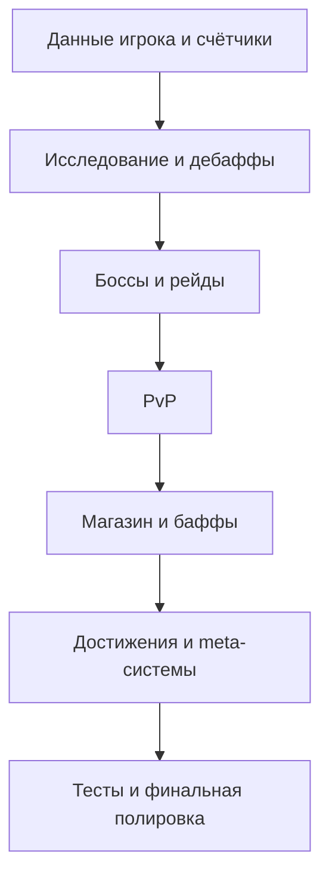

# План полировки существующих механик Last Hearth

## Цель
Довести текущие игровые системы до состояния, в котором:
- серверные формулы, счётчики и побочные эффекты согласованы между собой
- клиентский UI честно отражает фактическое состояние игры
- существующие механики читаются игроком без лишней путаницы
- регрессии ловятся тестами до выката

## Границы работы
В этом цикле не добавляется новый контент.
Фокус только на существующих системах:
- исследование
- радиация и инфекции
- энергия
- боссы и рейды
- PvP
- магазин, баффы, колесо
- профиль, достижения, рефералы, кланы
- счётчики прогресса, миграции, фоновые задачи

## Приоритеты

### P0
1. Слой прогресса и счётчиков
2. Согласованность API и UI
3. Ревизия побочных эффектов и миграций

### P1
1. Исследование и статусы
2. Боссы и рейды
3. PvP

### P2
1. Магазин и баффы
2. Профиль и journey
3. Клановый UX

## Рабочий план

### 1. Единый аудит данных игрока
Проверить и унифицировать:
- energy
- max_energy
- health
- max_health
- radiation
- infections
- buffs
- cosmetics
- items_collected
- bosses_killed
- referrals
- total_actions
- daily_streak

#### Что сделать
- составить карту, где каждое поле создаётся, изменяется и читается
- убрать расхождения old/new структур
- убедиться, что профили, scheduler и игровые роуты используют одну модель

#### Критерий готовности
Каждое ключевое поле имеет один понятный жизненный цикл и не меняется скрыто в неожиданных местах.

### 2. Полировка цикла исследования
#### Что проверить
- стоимость действия
- честность подсказок риска
- влияние экипировки
- влияние баффов
- рост радиации
- рост инфекций
- дроп предметов и ключей
- прирост опыта
- рост счётчика items_collected

#### Что сделать
- свести формулы риска, дропа и XP в единый набор констант
- синхронизировать серверную стоимость действий и клиентские подписи кнопок
- сделать UI-подсказки риска более прямыми и предсказуемыми
- проверить, что любой результат поиска приводит к понятному UI-ответу

#### Критерий готовности
Игрок понимает, что он тратит, что рискует получить и почему произошёл именно такой результат.

### 3. Полировка радиации и инфекций
#### Что сделать
- сверить накопление, лечение, распад по времени и штрафы
- унифицировать отображение в профиле, главном экране и статус-чеке
- убрать несогласованность между дебафф-логикой и summary UI

#### Критерий готовности
Любой дебафф имеет один источник правды по уровню, длительности, эффекту и способу лечения.

### 4. Полировка боссов и рейдов
#### Что сделать
- перепроверить формулы урона по ранней и средней прогрессии
- синхронизировать обычную атаку и атаку оружием по правилам наград
- проверить рейдовое распределение наград, энергии, мастерства и ключей
- унифицировать структуру ответов соло и рейдов для клиента
- сделать боевой итог более прозрачным для UI

#### Критерий готовности
Соло, оружейный добив и рейд ощущаются как части одной системы, а не как три разных набора правил.

### 5. Полировка PvP
#### Что сделать
- ещё раз пройти начало матча, удар, завершение, награды, потери и телепортацию
- проверить кулдауны, повторные запросы и завершённые матчи
- сделать награды и потери максимально прозрачными для игрока
- сверить клиентскую статистику и серверные источники данных

#### Критерий готовности
PvP предсказуем по правилам, устойчив к race-condition и не содержит скрытых потерь или фантомных наград.

### 6. Полировка магазина, баффов и колеса
#### Что сделать
- проверить, что каждый товар реально имеет игровой эффект
- отделить чисто визуальные покупки от функциональных на уровне UI
- синхронизировать описание товара, цену и фактический серверный эффект
- проверить поведение при недоступности AdsGram и внешних SDK

#### Критерий готовности
Игрок после покупки всегда понимает, что именно он получил, на сколько и где это видно.

### 7. Полировка достижений, рефералов и кланов
#### Что сделать
- добить совместимость таблицы player_achievements и существующих helper-функций
- проверить все счётчики прогресса достижений
- перепроверить реферальный цикл и бонусы по уровням
- проверить клановые состояния: вступление, выход, чат, участники онлайн, казна, total donated

#### Критерий готовности
Все meta-системы работают на одной модели данных и не расходятся между клиентом, scheduler и БД.

### 8. Регрессионная защита
#### Что сделать
- расширить тесты на счётчики, баффы, прогресс и награды
- добавить smoke-покрытие на критичные API-контракты
- зафиксировать сценарии регрессии после каждого блока правок

#### Критерий готовности
Любая поломка старого поведения быстро ловится автопроверкой.

## Порядок реализации
1. Данные игрока и счётчики
2. Исследование и дебаффы
3. Боссы и рейды
4. PvP
5. Магазин, баффы, колесо
6. Достижения, рефералы, кланы
7. Регрессионные тесты
8. Финальная UX-шлифовка

## Артефакты на выходе
- выровненные серверные формулы
- очищенные API-контракты
- исправленные счётчики прогресса
- усиленный пакет тестов
- более честный и понятный UI без добавления нового контента

## Контур выполнения

